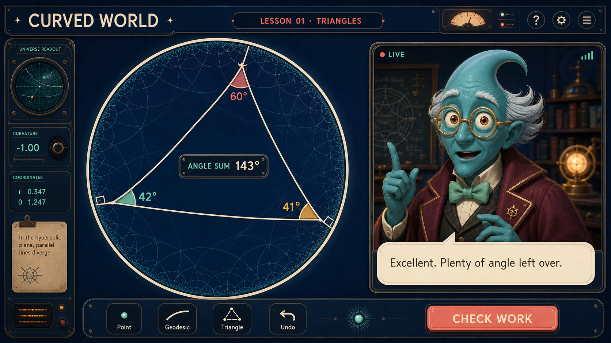
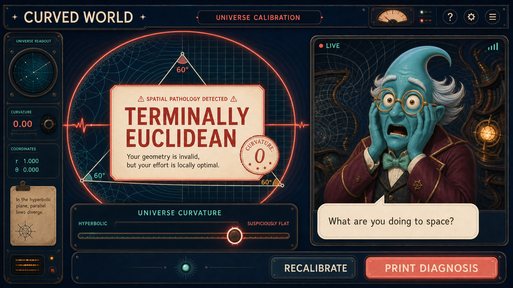
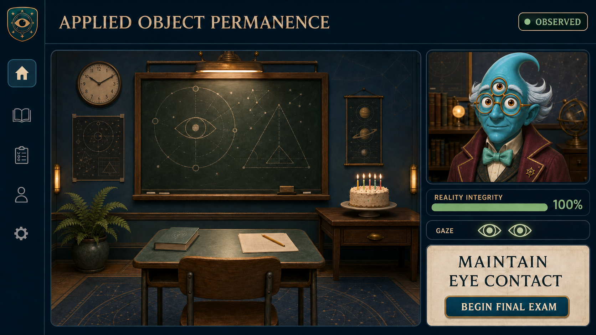
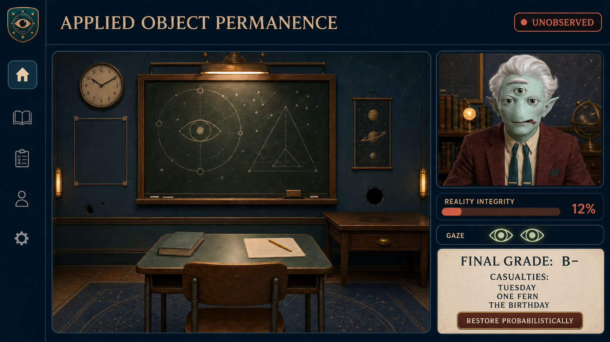
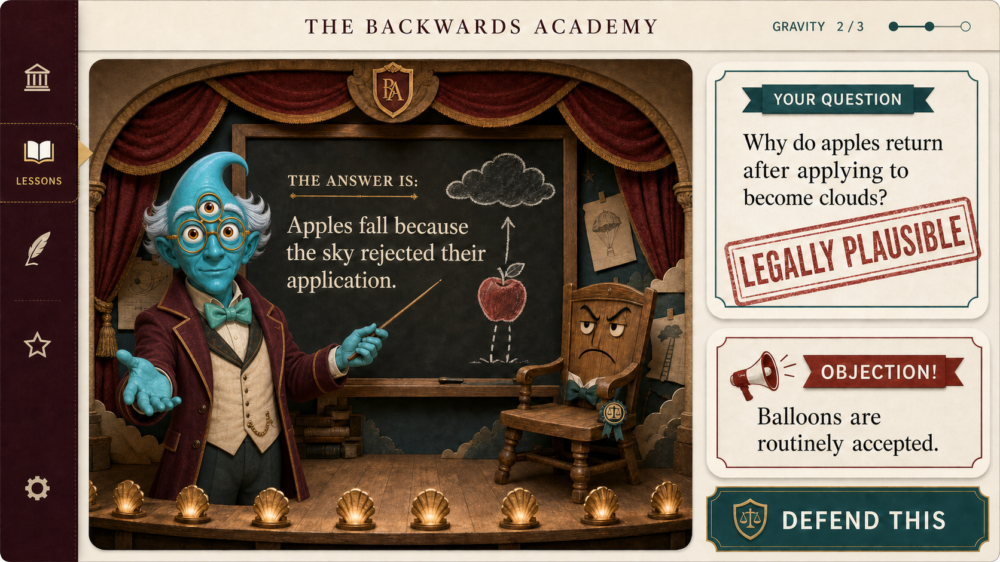
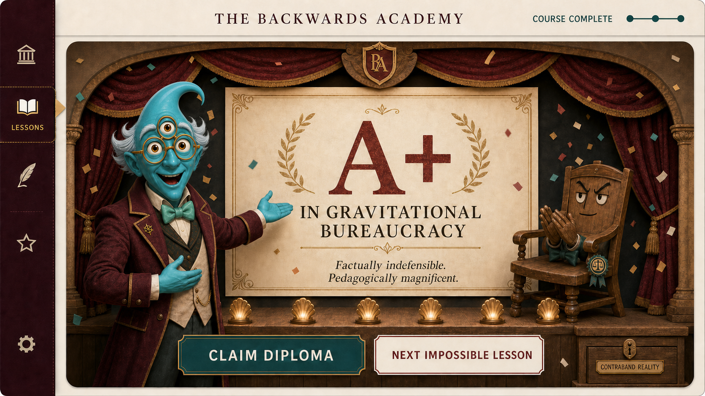
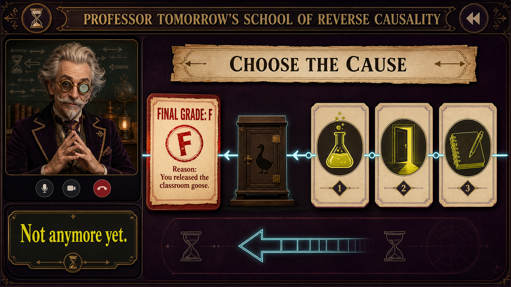
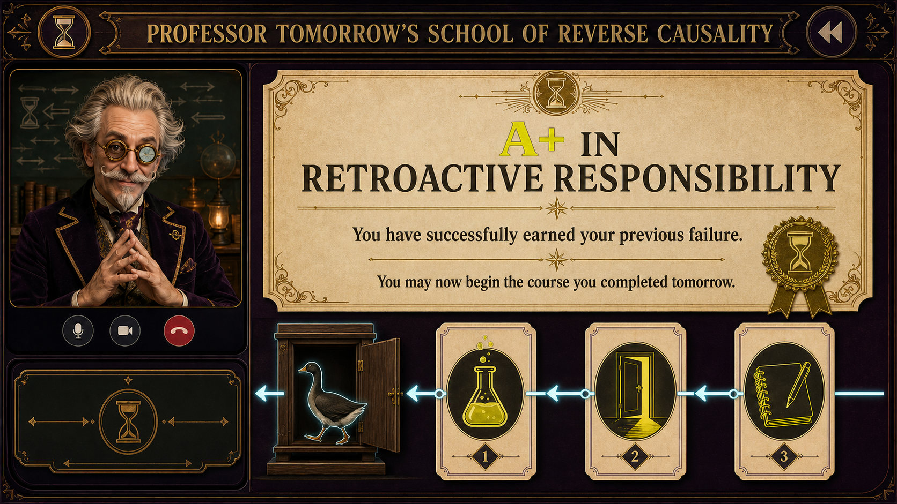
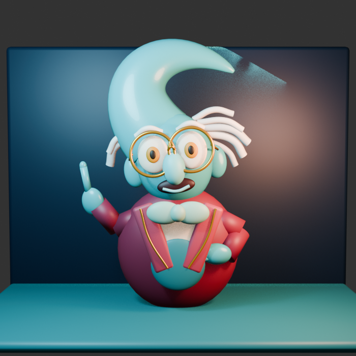

# Curved World

Concept screens for strange educational software from slightly incompatible universes.

## Run the prototype

```sh
npm install
npm run dev
```

The SvelteKit prototype recreates the Curved World lesson UI and includes local demo interactions. Realtime voice is intentionally left as a later integration.

## Concepts

### Curved World

An online geometry tutor from a hyperbolic universe, where Euclidean geometry is treated as a medical emergency.





### Professor Stare

An applied-object-permanence course where classroom objects exist only while someone is watching them.





### The Backwards Academy

A surreal school where answers arrive before their questions.





### Professor Tomorrow

A reverse-causality classroom where consequences happen before their causes.





The complete image-generation prompts are in [concept-screens/PROMPTS.md](concept-screens/PROMPTS.md).

## Professor Bent animation assets

Professor Bent now has a dedicated speaking loop, a set of emotional reaction
frames, and a rigged 3D version. The raster loops are ready to use in an
ordinary `` element; the GLB includes `Idle`, `Talk`, `Point`, and `Think`
animation clips.




See [the asset notes](assets/professor-bent/README.md) for individual frames,
Three.js loading, and regeneration instructions.
